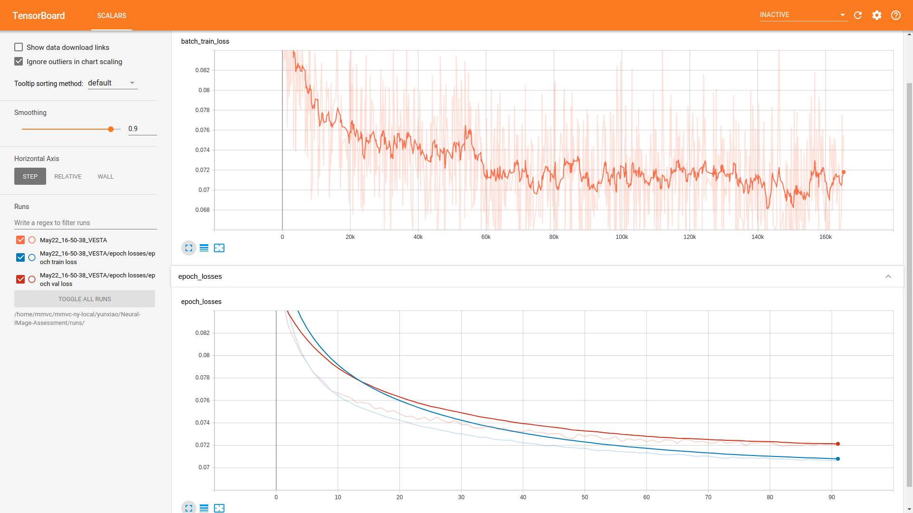

## NIMA: Neural IMage Assessment

This is a PyTorch implementation of the paper [NIMA: Neural IMage Assessment](https://arxiv.org/abs/1709.05424) (accepted at [IEEE Transactions on Image Processing](https://ieeexplore.ieee.org/document/8352823)) by Hossein Talebi and Peyman Milanfar. You can learn more from [this post at Google Research Blog](https://research.googleblog.com/2017/12/introducing-nima-neural-image-assessment.html).

## Implementation Details

+ The model was trained on the [AVA (Aesthetic Visual Analysis) dataset](http://refbase.cvc.uab.es/files/MMP2012a.pdf), which contains roughly 255,500 images. You can get it from [here](https://github.com/mtobeiyf/ava_downloader). **Note: there may be some corrupted images in the dataset, remove them first before you start training**.

+ The dataset is into 229,981 images for training, 12,691 images for validation and 12,818 images for testing.

+ An ImageNet pretrained VGG-16 is used as the base network of the model, for which I got a ~0.072 EMD loss on the validation set. Haven't tried the other two options (MobileNet and Inception-v2) in the paper. You are very welcome to make your own extensions.

+ The learning rate setting differs from the original paper. I can't seem to get the model to converge with momentum SGD using an lr of 3e-7 for the conv base and 3e-6 for the dense block. Also I didn't do much hyper-param tuning therefore you could probably get better results. Other settings are all directly mirrored from the paper.

+ The code is tested with python3.6+.

## Requirements

Either ```pip install -r requirements.txt``` to install the required dependencies or use [conda](https://docs.conda.io/en/latest/) to manage your env.

## Usage

To start training on the AVA dataset, first download the dataset from the link above and decompress which should create a directory named ```images/```. Then download the curated annotation CSVs below
which already splits the dataset (You can create your own split of course). Then do

```python
python main.py --img_path /path/to/images/ --train --train_csv_file /path/to/train_labels.csv --val_csv_file /path/to/val_labels.csv --conv_base_lr 3e-4 --dense_lr 3e-3 --decay --ckpt_path /path/to/ckpts --epochs 100 --early_stoppping_patience 10
```

For inference, here the predicted score mean and std is generated. See ```predictions/``` for an example format.

```python
python test.py --model /path/to/your_model --test_csv /path/to/test_labels.csv --test_images /path/to/images --predictions /path/to/save/predictions
```

## Training Statistics

Training is done with early stopping monitoring. Here I set ```patience=10```.
<p align="center">

</p>

## Pretrained Model
[Google Drive](https://drive.google.com/file/d/1NISOS1aZ54oFm65XkY4rISA1xXUgE1PP/view?usp=sharing)

## Annotation CSV Files
[Train](https://drive.google.com/file/d/1w313GtuqEBp0qqavdKSYHst-AAbQSTmq/view?usp=sharing) [Validation](https://drive.google.com/file/d/1GsrkIdn7Jcg--2y3iuuDqvEpc_6oV36w/view?usp=sharing) [Test](https://drive.google.com/file/d/17yvYHOc3CMq-04ZDri7BieXqwh2H633c/view?usp=sharing)

## Example Results

+ Here shows the predicted mean scores of some images from the validation set. The ground truth is in the parenthesis.

<p align="center">

</p>

+ Also some failure cases...

<p align="center">

</p>

+ The predicted aesthetic ratings from training on the AVA dataset are sensitive to contrast adjustments. Below images from left to right in a row-major order are with progressively sharper contrast. Upper rightmost is the original input.
<p align="center">

</p>
