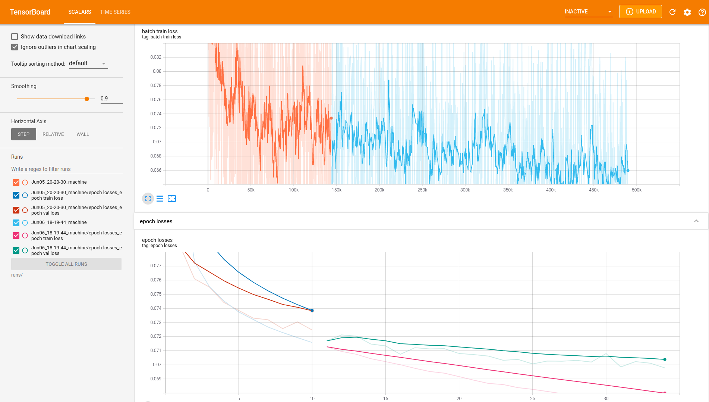
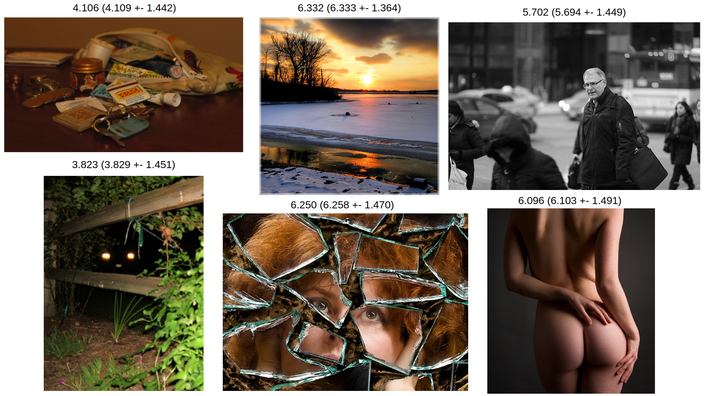
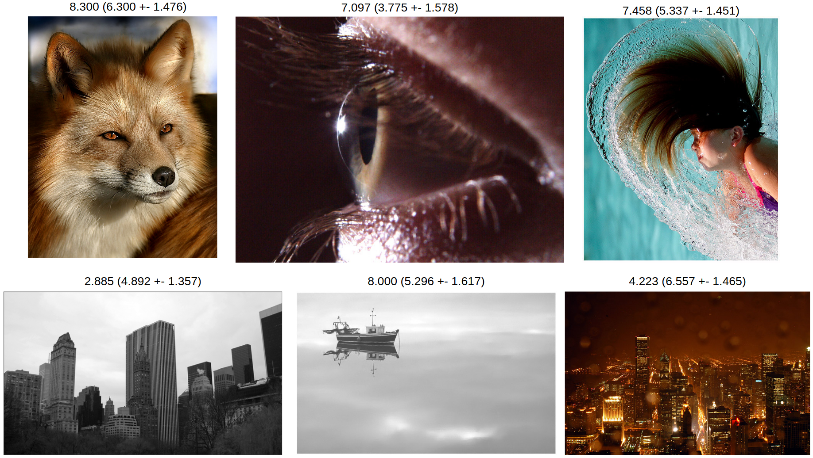

## NIMA: Neural IMage Assessment

[](https://www.python.org/)
[](./LICENSE)

This is a PyTorch implementation of the paper [NIMA: Neural IMage Assessment](https://arxiv.org/abs/1709.05424) (accepted at [IEEE Transactions on Image Processing](https://ieeexplore.ieee.org/document/8352823)) by Hossein Talebi and Peyman Milanfar. You can learn more from [this post at Google Research Blog](https://research.googleblog.com/2017/12/introducing-nima-neural-image-assessment.html).

## Implementation Details

+ The model was trained on the [AVA (Aesthetic Visual Analysis) dataset](http://refbase.cvc.uab.es/files/MMP2012a.pdf) containing 255,500+ images. You can get it from [here](https://github.com/mtobeiyf/ava_downloader). ~~**Note: there may be some corrupted images in the dataset, remove them first before you start training**.~~ Use provided CSVs which have already done this for you.

+ Dataset is split into 229,981 images for training, 12,691 images for validation and 12,818 images for testing. 

+ An ImageNet pretrained VGG-16 is used as the base network. Should be easy to plug in the other two options (MobileNet and Inception-v2).

+ The learning rate setting differs from the original paper. Can't seem to get the model to converge using the original params. Also didn't do much hyper-param tuning therefore you could probably get better results. Other settings are all directly mirrored from the paper.

## Requirements

Code is written using [PyTorch](https://pytorch.org/get-started/locally/) 1.8.1 with [CUDA](https://developer.nvidia.com/cuda-toolkit) 11.1. You can recreate the environment I used with [conda](https://docs.conda.io/en/latest/miniconda.html) by
```
conda env create -f env.yml
```  
to install the dependancies.

## Usage

To start training on the AVA dataset, first download the dataset from the link above and decompress which should create a directory named ```images/```. Then download the curated annotation CSVs below
which already splits the dataset (You can create your own split of course). Then do

```python
python main.py --img_path /path/to/images/ --train --train_csv_file /path/to/train_labels.csv --val_csv_file /path/to/val_labels.csv --conv_base_lr 5e-4 --dense_lr 5e-3 --decay --ckpt_path /path/to/ckpts --epochs 100 --early_stoppping_patience 10
```

For inference, do

```python
python -W ignore test.py --model /path/to/your_model --test_csv /path/to/test_labels.csv --test_images /path/to/images --predictions /path/to/save/predictions
```

See ```predictions/``` for dumped predictions as an example.

## Training Statistics

Training is done with early stopping. Here I set ```early_stopping_patience=10```.
<p align="center">

</p>

## Pretrained Model

~0.069 EMD on validation. Not fully converged yet (constrained by resources). To continue training, download the pretrained weights and add ```--warm_start --warm_start_epoch 34``` to your args.

[Google Drive](https://drive.google.com/file/d/1w9Ig_d6yZqUZSR63kPjZLrEjJ1n845B_/view?usp=sharing)

## Annotation CSV Files
[Train](https://drive.google.com/file/d/1IBXPXPkCiTz04wWcoReJv4Nk06VsjSkI/view?usp=sharing) [Validation](https://drive.google.com/file/d/1tJfO1zFBoQYzd8kUo5PKeHTcdzBL7115/view?usp=sharing) [Test](https://drive.google.com/file/d/105UGnkglpKuusPhJaPnFSa2JlQV3du9O/view?usp=sharing)

## Example Results

+ Here first shows some good predictions from the test set. Each image title starts with ground-truth rating followed by the predicted mean and std in the parentheses. 

<p align="center">

</p>

+ Also some failure cases, it would seem that the model usually fails at images with low/high aesthetic ratings.

<p align="center">

</p>

+ The predicted aesthetic ratings from training on the AVA dataset are sensitive to contrast adjustments, preferring images with higher contrast. Below top row is the reference image with contrast ```c=1.0```,  while bottom images are enhanced with contrast ```[0.25, 0.75, 1.25, 1.75]```. Contrast adjustment is done using ```ImageEnhance.Contrast``` from ```PIL``` (in this case [pillow-simd](https://github.com/uploadcare/pillow-simd)). 

<p align="center">

</p>

## License

MIT
